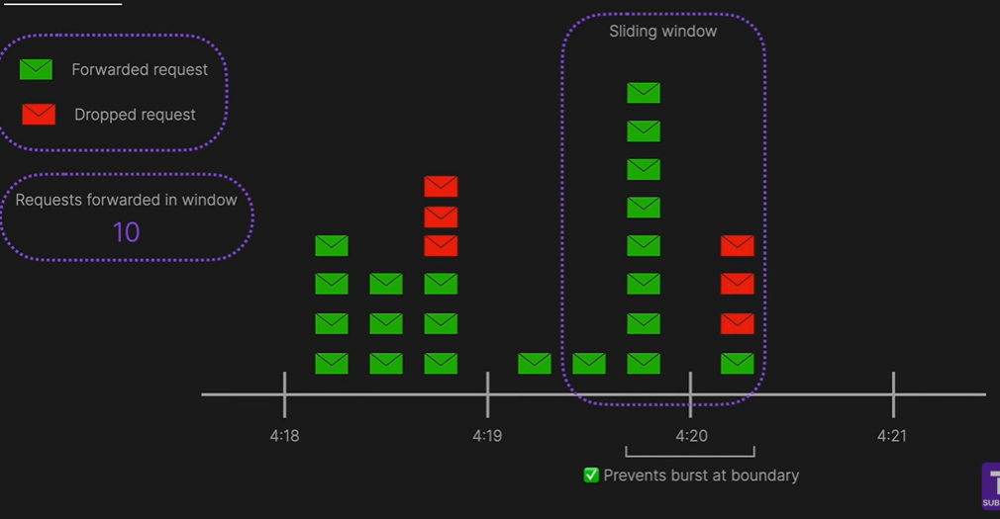

# API Gateway

* In modern system architecture, APIs connect clients (web, mobile, third-party apps) to backend services.
* Directly exposing backend services can lead to performance, security, and management challenges.
* API Gateway is a centralized entry point for all API requests, handling authentication, routing, caching, and security.

## How api gateway works

## Benefits

