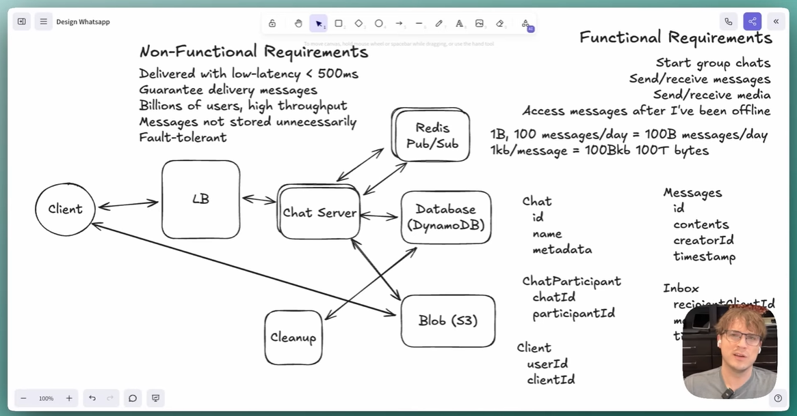
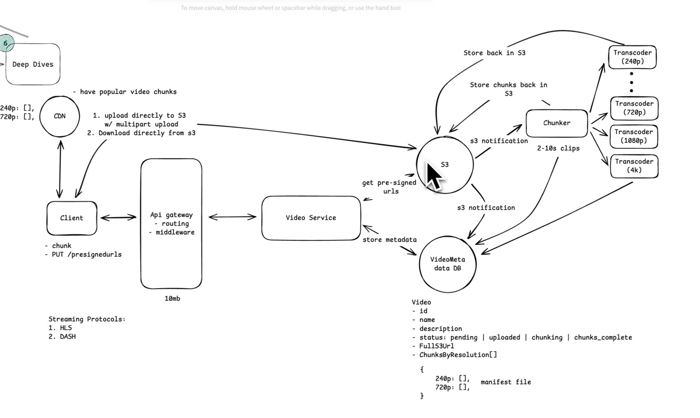

## Whats up system design


## Scenario Recap
1. User A sends a message.
2. Message goes through Load Balancer → Chat Server A.
3. User B is connected to a different server — Chat Server B.

### Question: How does User B receive the message in real time if they're on a different server?
To solve this, WhatsApp (or similar systems) uses server-to-server communication via a Pub/Sub system or Message Queue, typically backed by something like:
* Apache Kafka
* Redis Pub/Sub
* RabbitMQ
* Custom TCP-based internal protocol
```plaintext
User A
  ↓
Load Balancer
  ↓
Chat Server A
  ↓
Publish message to a shared Message Bus (Kafka/Redis/etc)
  ↓
Chat Server B subscribes to topics relevant to its connected users
  ↓
Chat Server B receives message for User B
  ↓
Load Balancer
  ↓
User B (via WebSocket / Push Notification)
```

### How does a WebSocket connection stay connected to the same chat server after going through the load balancer?
* The first time a client connects, the load balancer routes it to Chat Server A.

* Then it uses a mechanism like a cookie, IP hash, or routing table to make sure all future packets from this client go to the same server.

| Load Balancer | Sticky Session Method      |
| ------------- | -------------------------- |
| **Nginx**     | `ip_hash`, `sticky` module |
| **AWS ELB**   | Uses cookies (`AWSALB`)    |
| **HAProxy**   | `stick-table`              |
| **Traefik**   | `StickySessions=true`      |

### ✅ Concept of ip_hash:
ip_hash uses the client's IP address to determine which backend server should handle the request. The same IP will always be routed to the same server, as long as the server is available.

1. Client A (192.168.1.10) sends a request.
2. Load balancer applies a hash function on the IP: hash(192.168.1.10)
3. That hash determines which backend server (e.g., Server A) should serve the request.
4. Future requests from the same IP are routed to Server A again.

### ⚠️ Limitations of ip_hash:
| Problem                 | Explanation                                                                |
| ----------------------- | -------------------------------------------------------------------------- |
| 💻 **Shared IPs**        | Users behind NAT (e.g., office WiFi) share IP → all go to the same server. |
| 🔄 **Scaling Imbalance** | Hashing may not distribute traffic evenly.                                 |
| 🔌 **Failover issues**   | If a server goes down, users must reconnect and may lose state.            |
| 🧑‍💻 **IPv6 and Proxies**  | IP hash may be inconsistent with IPv6 or when behind proxies.              |


### Health check  
```nginx
upstream backend {
  ip_hash;
  server chat1.example.com;
  server chat2.example.com max_fails=3 fail_timeout=10s;
}

```
* If chat2 fails 3 times within 10 seconds → it’s marked as unavailable.
* NGINX will skip it during hashing → client is routed to chat1.


### Challenges
1. we using non sql db because we have some challenges on sql DB while scale it
1. if the chat server multiple, user_a connected to server_a and user_b connected to server_b then how the user_a message send to user_b as they are connected to different server. for that reason we are using redis, redis know which server connect to which user
2. user_a send a message and chat server get the detail user_b connection detail from redis and connected throw hash by server b and send the message
3. websocket is a single connection. if it connected it should not be disconnected.


## Youtube
