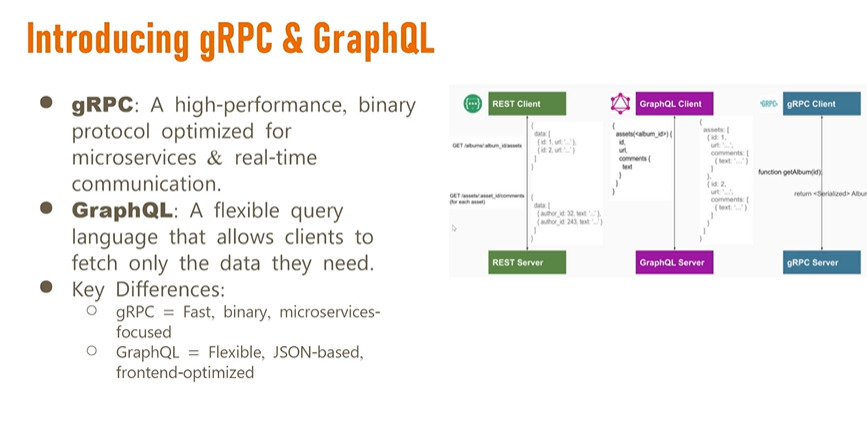

# Load Balancer
A Load Balancer is like a traffic cop sitting in front of your servers.  

✅ It distributes incoming client requests (HTTP, HTTPS, TCP, etc.) across multiple backend servers. 
✅ It makes sure no single server is overloaded. 
✅ If a server goes down, it routes traffic to healthy servers. 

Think of it like: 

“There are 5 counters at a bank. You go to the receptionist (load balancer), and she tells you which counter to go to based on which is free.”
 

## 🛠️ Why do we use Load Balancers in System Design?
1. **Scalability 📈**
Add more servers as traffic grows. LB will distribute the load.
2. **High Availability ✅**
If one server fails, LB sends traffic to others. No downtime.
3. **Better Performance ⚡**
Balances the workload across servers, avoiding bottlenecks.
4. **Flexibility 🔄**
Easy to upgrade, replace, or take down servers without affecting users.

## Types of Load Balancers
* Hardware Load Balancer (expensive, used in data centers)
* Software Load Balancer (e.g., HAProxy, Nginx, Envoy)
* Cloud-based LB (AWS ELB, Azure LB, GCP LB)

## ⚙️ How does a Load Balancer distribute traffic?
  ### Static load balancing (using predefined rules with out considering the real time server condition, while work loads are predictable)
  * Round Robin 🌀  
  Sends requests in order (1,2,3,1,2,3).

  * Least Connections 📉  
  Sends requests to the server with the fewest active connections. for example if the server hit expensive query in the data base, so it will take more time to respond back so the connect will alive for some long time. 

  * IP Hashing 🧮 
  Routes requests based on client IP.

  ### Dynamic load balancing (Considering servers realtime condition)
  * Least response time  
    Sends the request to the server with the fastest response.
  * Adaptive load balancing  
    It is making intelligent routing decision by analyzing cpu usage, memory usage 
  * Weighted Round Robin ⚖️ 
  Servers get traffic based on their capacity (powerful servers get more requests).  
  assign different weight to server based on capacity

## when to use
* software load balancer gives much more flexibility
* cloud load balancer give much more scalability.
* hardware for enter price grader

## Key take away

---

* Based on Layer
* Based on Deployment
  * Hardware load balancer: Specialized devices (F5, Citrix)
  * Software load balancer (nginx, HAproxy)
  * Cloud base load balancer: ELB(AWS Elastic Load Balance)

## Questions
1. how to choose right load balancer
2. based on layer. layer 4 and layer 7 explain bit more on this