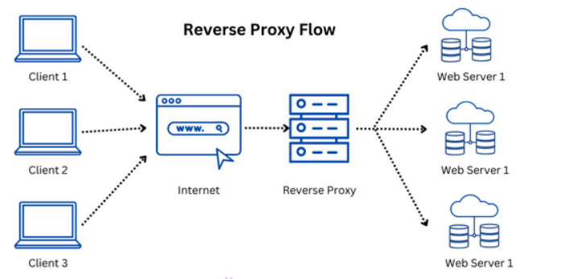
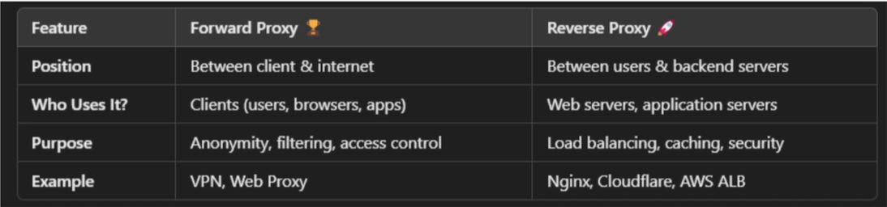

# Forward and Reverse Proxy


# Revers Proxy
* A reverse proxy is a server that sits in front of one or more backend servers and handles requests from clients (like web browsers) on their behalf. Instead of the client connecting directly to the backend server, the reverse proxy acts as an intermediary:

1. The client sends the request to the proxy.
2. The proxy forwards it to the appropriate backend server.
3. When the backend responds, the proxy sends the response back to the client.<br>

So from the client’s point of view, it looks like the reverse proxy is the server.

### 🎯 Why use a Reverse Proxy?
A reverse proxy isn’t just an extra hop—it provides many advantages:<br>

✅ **Load balancing** – Distributes incoming traffic across multiple backend servers to avoid overloading any single one. <br>
✅ **SSL Termination** – Handles HTTPS encryption/decryption, offloading that work from backend servers.<br>
✅ **Caching** – Stores copies of responses to serve repeated requests faster.<br>
✅ **Security** – Hides backend servers from the public internet (clients never directly contact them), reducing the attack surface.<br>
✅ **Compression** – Compresses responses before sending them to clients, saving bandwidth.<br>
✅ **Centralized Authentication** – Can enforce authentication before requests hit backend servers.<br>

### What is mean by compression
When a backend server sends a response (like an HTML page, JSON data, CSS, JS files, etc.), the reverse proxy (NGINX) can compress that response before sending it to the client’s browser. <br>
This means:<br>
* The browser downloads a smaller file over the network.
* Less bandwidth is used.
* The page loads faster for the user. 
  ### 🛠 How does it work?
  1. The client browser tells the server it supports compressed data:
  ```js
  Accept-Encoding: gzip, deflate, br
  // (This header means “I can handle compressed content.”)
  ```
  1. NGINX (reverse proxy) sees this header and:
  ✅ Takes the backend response
  ✅ Compresses it using a supported algorithm like gzip or brotli
  ✅ Sends the compressed response to the client

  1. The browser then decompresses the data automatically and renders it normally.





### Is a Reverse Proxy a Load Balancer?
Not exactly.
But a reverse proxy can act as a load balancer.
* Sits between the client and backend servers.
* Forwards client requests to backend servers and sends their responses back to the client.
* Main purpose: hides backend servers and adds features like SSL termination, caching, security, etc.
* It does not have to distribute traffic—it could forward all requests to a single backend server.
* A reverse proxy can be configured to perform load balancing
* So when you use NGINX as a reverse proxy, you can also add a upstream block to make it act as a load balancer:

# Forward Proxy?
A forward proxy is a server that sits between a client (like your browser) and the internet.<br>
When a client wants to access a website:<br>

* Instead of sending the request directly to the site, it sends the request to the forward proxy.

* The proxy forwards the request to the internet, gets the response, and sends it back to the client.

So the website never sees the client’s real IP address—it only sees the proxy’s IP.<br>

### 📖 How does it work?
1. Your browser sends a request to the forward proxy:
GET http://example.com
2. The forward proxy forwards the request to example.com.
3. It receives the response from example.com.
4. It passes the response back to your browser.

### ✅ Why use a Forward Proxy?
* 🌐 Access blocked content (e.g., bypass geo-restrictions).
* 🛡 Hide client’s IP address (anonymity).
* 📦 Cache content for faster access.
* 🚨 Enforce policies (block some sites or monitor usage).


## Comparison of forward and revers proxy
