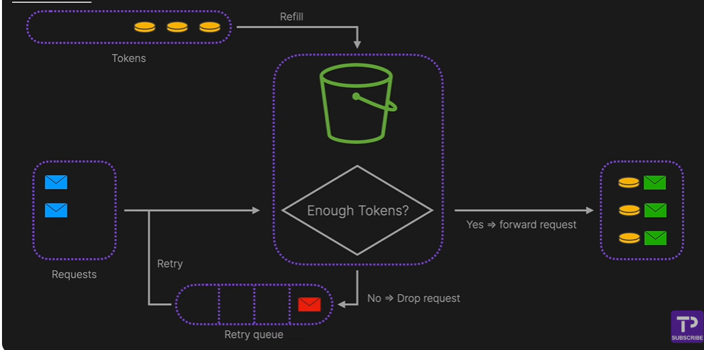
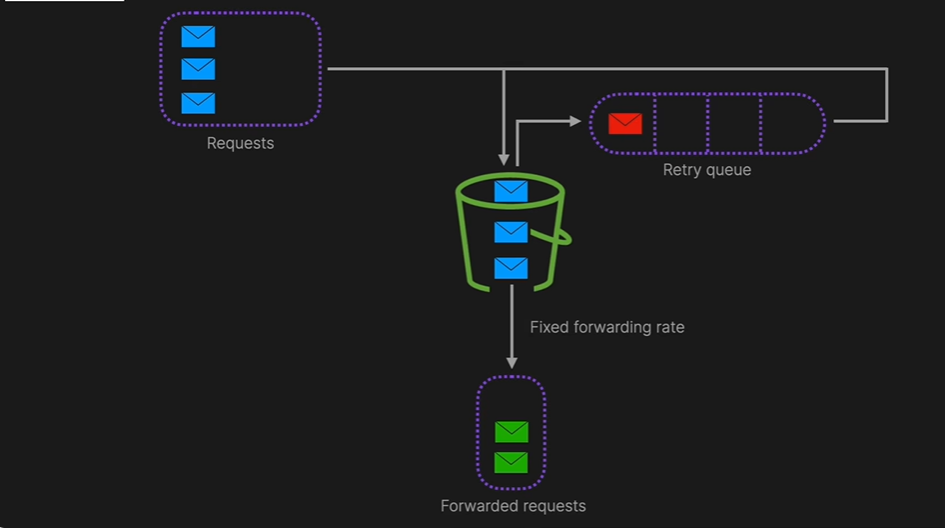
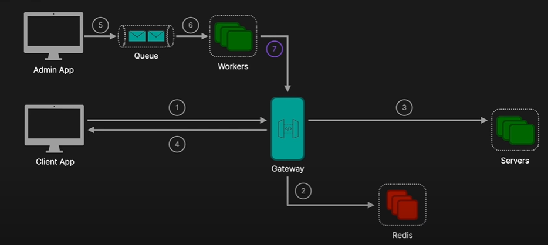

# Rate Limiter
A rate limiter controls how many requests a user or system can make to a resource (like an API) within a specific time window.

This prevents:
1. Abuse (e.g., spammy users hitting the API thousands of times per second)
2. Overload (e.g., too many requests crashing a backend service)
3. Fair usage (e.g., free users get 100 requests/minute, premium get 1000)

## 📐 Common Use Cases
* APIs (e.g., `GET /users/123` limited to 100 requests per minute per IP)
* Login attempts (e.g., max 5 tries per user in 10 minutes)
* Messaging systems (e.g., 50 messages per day for free-tier users)

## Error code
429 - Too many request

## 1. Token Bucket algorithm
* Tokens are added at a rate (e.g., 1 per second)
* Each request consumes a token; if no token, reject
* ✅ Allows bursts, but maintains average rate

### Example
Say you have:  
* Capacity = 10 tokens 
* Refill rate = 1 token/sec 

At t=0, bucket is full (10 tokens).  
User sends 5 requests → 5 tokens left. 
At t=3, user sends 7 requests → only 8 tokens available → 1 request is rejected.   

### 🧰 Where to Implement It?
* At the API Gateway (e.g., NGINX, AWS API Gateway)
* In Middleware (e.g., Express.js or Django middleware)
* In Distributed Caches (e.g., Redis used to track counters globally)

## 2. Leak Bucket algorithm
* Requests go into a "bucket" and leak at a fixed rate
* ✅ Smooths traffic; similar to token bucket, but focused on output rate

## Fixed window counter
* Count requests in fixed time windows (e.g., per minute)
* ✅ Simple
* ❌ Bursts at window edges (e.g., 100 at 11:59, 100 more at 12:00)

## Sliding window log
* Keep a log (timestamped list) of each request
* Check how many were in the last X seconds
* ✅ Accurate
* ❌ High memory for large scale

## Architecture

### ✅ Good Practices
* Return clear HTTP status like 429 Too Many Requests
* Include headers:
  * Retry-After
  * X-RateLimit-Limit
  * X-RateLimit-Remaining
* Use exponential backoff on retries
* Separate limits by user/IP/endpoint if needed

