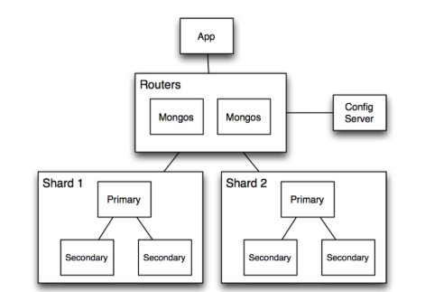

# 🌐 MongoDB Sharding Guide

Sharding is splitting your data across multiple machines (or nodes) so that each node holds only a part of the data. Together, these nodes form a **cluster** and can handle more data and traffic than a single machine.

---

## 🧱 What is Sharding?

Sharding is **splitting your data across multiple machines (or nodes)** so that each node holds only a part of the data. Together, these nodes form a **cluster** and can handle more data and traffic than a single machine.

### Why do we need it?
- A single server might not have **enough storage** for all your data.
- A single server might not handle **all the read/write traffic**.
- Adding more powerful servers (vertical scaling) is **expensive and limited**.

So we **scale out** (horizontally) by adding more machines and distributing the load.

---

## 🍃 How does MongoDB Sharding Work?

In MongoDB, sharding is implemented with a **sharded cluster**, which has 3 main components:

### 1️⃣ Shards
- These are the actual databases that store your data.
- Each shard holds a **subset of your data**.
- Usually, each shard is itself a **replica set** (to ensure high availability).

Think of shards as **buckets** where your data is distributed.

### 2️⃣ Config Servers
- These servers store the **metadata** and configuration of the cluster, such as:
  - What data is stored in which shard.
  - Cluster topology.
- There are usually **3 config servers** (to ensure fault tolerance).

Without config servers, the cluster wouldn’t know where to find your data.

### 3️⃣ Query Routers (mongos)
- These act as a **gateway** between your application and the cluster.
- When your app sends a query:
  - The query router checks the config servers for metadata.
  - It forwards the query to the correct shard(s).

You can have **multiple mongos routers** for load balancing.

---

## 🗺️ How is Data Split Across Shards?

This happens using a **shard key**.

- **Shard Key** = A field in your documents used to decide **how to split data**.
- MongoDB divides data into **chunks** based on the shard key.
- Each chunk is assigned to a shard.

### 🔑 Example
Let’s say you have this collection:

```json
{ "_id": ObjectId(...), "user_id": 123, "name": "Alice", "age": 30 }
```

If you choose `user_id` as the **shard key**, MongoDB will split the dataset based on ranges of `user_id` values.

---

### ⬇️ Sharding Strategies

MongoDB supports **two ways** to divide data:

✅ **1. Ranged Sharding**  
- Data is split into **ranges** based on the shard key.
- Example:
  - `user_id` 1–1000 → Shard A
  - `user_id` 1001–2000 → Shard B

✅ **2. Hashed Sharding**  
- MongoDB hashes the shard key values and assigns chunks based on hash values.  
- This spreads data **more evenly**, avoiding hotspots.

---

## 🧠 What happens during a Query?
- If the query includes the **shard key**, MongoDB can route it directly to the correct shard (**targeted query**).
- If the query doesn’t include the shard key, it may need to **scatter-gather** (send the query to all shards and merge results). This is slower.
---

## 🪛 Example Architecture Diagram


---

## ⚠️ Things to Watch Out For
- **Choosing a bad shard key** (e.g., monotonically increasing values) can lead to **hotspots** and unbalanced shards.
- Avoid queries without the shard key.
- Make sure to plan for **chunk migrations** when shards fill unevenly.

---

## ✅ Why MongoDB Sharding is Useful
- Handles **huge datasets** that don’t fit on one server.
- Increases **read/write throughput**.
- Provides **automatic failover** (with replica sets).

## 🧐 Can You Shard an Existing Single MongoDB Database?
✅ **Yes, you *can shard an existing MongoDB database***
1. Add Your Existing Database as a Shard
2. Enable Sharding on the Database
3. Choose a Shard Key for Collections
4. - Pick a **shard key** carefully. Once chosen, **it cannot be changed**.
   - Enable sharding on a collection:

## ⚠️ Important Considerations

### ✅ What Works
- MongoDB can **split the existing data into chunks** and distribute them across shards.
- This process is called **chunk migration**.

### ❌ What You Can’t Do
- You **cannot shard a collection without a shard key**.
- Once a collection is sharded, **you cannot change the shard key**.

### 🔥 Caution
- Sharding a collection with **a large amount of existing data** can be resource-intensive and impact performance during balancing.


## Questions
1. Is that sharding for database or all the document