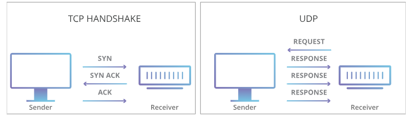

# UDP PROTOCOL
* UDP (User Datagram Protocol) is a simple and fast communication protocol used in computer networks. It is part of the Transport Layer (Layer 4) in the OSI model.

* UDP (User Datagram Protocol) is a communication protocol used to send data between computers over a network.

* It's like sending a letter without getting confirmation that the other person received it.

* It's fast, simple, and does not guarantee delivery.

## 🧠 How Does UDP Work?
1. No Connection Setup
   * Unlike TCP, UDP does not establish a connection between sender and receiver.
   * You just send the data, and that’s it. No “hello” or “are you ready?” before sending.
2. Data is Sent as Datagrams
  * The sender breaks the data into small chunks called datagrams.
  * Each datagram is like an envelope with:
    * Source port (who sent it)
    * Destination port (who should receive it)
    * Data
    * Optional checksum for error detection
3. Datagrams are Sent to Receiver
   * The datagrams travel across the network independently.
   * They may arrive out of order, or get lost, or be duplicated.
4. Receiver Gets Datagrams (if they arrive)
   * The receiver listens on a specific port number.
   * If a datagram arrives, the application reads the data.
   * But: If data is missing or broken, UDP will not fix it — the application has to deal with that.
   * 
## 📦 Real-life Example:
Imagine you're watching a live cricket match on your phone (video streaming):

* The app uses UDP to quickly send video frames.
* If one frame is lost, the next one comes — the video continues without waiting.
* You prefer speed over perfection, because you want to see it in real time.

## Visual Diagram
