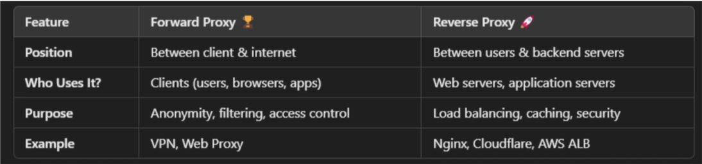

## 🔌 What is WebSocket?
WebSocket is a communication protocol that provides full-duplex (two-way) communication between a client (like a browser) and a server over a single, long-lived connection. It is using single TCP connection.

## 🛠️ How WebSocket Works
1. Initial Handshake (via HTTP):
   * The client sends an HTTP request with an Upgrade: websocket header.
   * If the server supports it, it replies with a 101 Switching Protocols response.
2. Upgraded Protocol:
  * Once the handshake is complete, both sides communicate using the WebSocket protocol.
  * The connection stays open—no need to re-request every time.
3. Data Transfer:
   * Data is exchanged in frames (not full HTTP messages).
   * It's lightweight, with less overhead than HTTP.

## 🧠 Use Cases
* Real-time chat apps (e.g., Slack, WhatsApp Web)
* Online multiplayer games
* Stock ticker dashboards
* Collaborative tools (e.g., Google Docs live editing)
* Live sports scores or auction updates

## 🔐 Security: ws:// vs wss://
* ws:// = WebSocket over plain TCP (insecure)
* wss:// = WebSocket over TLS (secure), like HTTPS

## Long Polling
Long polling is a technique used to achieve near real-time communication between a client (like a browser) and a server over HTTP, before technologies like WebSocket were common.

## 🧠 What Is Long Polling?
Long polling is a way to simulate real-time updates in a request-response model like HTTP.  
Here's how it works: 
1. The client sends an HTTP request to the server.
2. The server holds the request open until:
   * New data is available, or
   * A timeout occurs (e.g. 30 seconds).
3. Once the server responds, the client immediately sends another request.
4. Repeat...

## 🔁 Long Polling vs WebSocket vs Regular Polling
| Feature         | Regular Polling        | Long Polling          | WebSocket                 |
| --------------- | ---------------------- | --------------------- | ------------------------- |
| Connection Type | Repeated HTTP requests | Repeated, but delayed | One persistent connection |
| Latency         | Medium to High         | Lower                 | Very Low                  |
| Server Push?    | No                     | Yes (sort of)         | Yes                       |
| Complexity      | Simple                 | Moderate              | Higher (but efficient)    |
| Overhead        | High                   | Lower than polling    | Very low                  |

## when to use websocket and long polling
