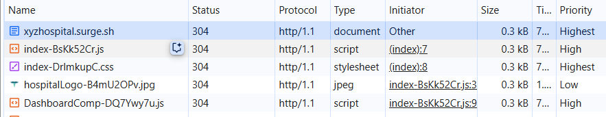
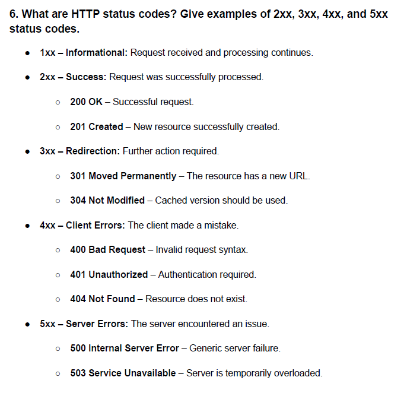

# HTTP Protocol Overview
* HTTP (Hypertext Transfer Protocol) is the foundation of data communication on the World Wide Web. It is an application-layer protocol used for transmitting hypermedia documents, such as HTML.
* HTTP is a request-response protocol, where a client (usually a web browser) sends a request to a server, which then responds with the requested resource.
* HTTP operates over TCP/IP, ensuring reliable data transfer. It is stateless, meaning each request from a client to a server is treated as an independent transaction, without retaining session information.
* HTTP/1.1 can give 6 parallel call at a time, if there is 20 calls, the first 6 call send first, rest 14 calls will be queued. once the first 6 resolved, then other 6 will be be execute. to prevent multiple TCP connection.
* HTTP/2: allow 100+ requests are sent immediately, and the server responds as it’s able — based on request priority, bandwidth, and flow control. as it is using Multiplexing concept one TCP connection enough for multiple request.
* http1.1 parallely create 6 TCP connection.
TCP connection will not close until something happen.
This same opened connection http used there feature request as well

## ✅ When does HTTP/2 close the TCP connection?
HTTP/2 opens one persistent TCP connection per origin. It closes that connection when one of the following happens:
1. Inactivity / Idle Timeout
If there's no activity (no requests or responses) for a while, the connection may be closed to free up resources.

* Who sets the timeout?
  * Server often sets the idle timeout. E.g., NGINX might have a default of 5–10 minutes.
  * Browsers may also proactively close idle connections if system memory is low or there's pressure.

# 🌐 Difference Between HTTP and HTTP/2

HTTP/1.1 (commonly referred to as HTTP) and HTTP/2 are protocols used for transferring data over the web. HTTP/2 is a major revision aimed at improving speed, performance, and efficiency.

---

## 🔑 Key Differences

| Feature                    | HTTP/1.1                                                                                 | HTTP/2                                                                                 |
| -------------------------- | ---------------------------------------------------------------------------------------- | -------------------------------------------------------------------------------------- |
| **Multiplexing**           | ❌ Not supported – Only one request per TCP connection. Leads to "head-of-line blocking". | ✅ Supported – Multiple requests/responses over a single TCP connection simultaneously. |
| **Header Compression**     | ❌ No compression – Headers sent as plain text, causing redundancy.                       | ✅ Uses HPACK – Compresses headers, reducing overhead.                                  |
| **Binary Protocol**        | ❌ Text-based (human-readable)                                                            | ✅ Binary format (machine-efficient) – More compact and less error-prone.               |
| **Server Push**            | ❌ Not available                                                                          | ✅ Supported – Server can proactively send resources to the client before requested.    |
| **Request Prioritization** | ❌ Not available                                                                          | ✅ Allows prioritization of requests for better performance.                            |
| **Connection Management**  | ❌ Multiple TCP connections needed for parallel requests                                  | ✅ Single TCP connection handles all concurrent streams                                 |
| **Security (TLS)**         | 🔸 Optional                                                                               | 🔸 Optional (but most browsers require TLS for HTTP/2)                                  |

---

### What is server push
#### 🧠 The Usual Way (HTTP/1.1 or No Server Push):
  1. You visit a webpage (e.g., example.com/index.html)
  2. Your browser gets index.html
  3. The browser parses the HTML and sees it needs style.css, app.js, and maybe some images.
  4. The browser then sends separate requests for each of those files.
  5. Server responds with each file as requested.  

🕓 This involves multiple round-trips: first request for the HTML, then more for CSS, JS, images, etc. 

#### 🚀 With Server Push (HTTP/2): 
  1. You visit example.com/index.html
  2. The server knows (e.g., via config or past experience) that you'll definitely need style.css and app.js.
  3. Along with the HTML, the server also pushes style.css and app.js without waiting for you to ask.

Result: Fewer round-trips, faster loading ⚡

#### 📦 In Simple Terms:
* Without Server Push: Client requests → Server responds
* With Server Push: Server says, "Hey, I know you'll need these files too. Here they are!"

### Request Prioritization
* 🔴 In HTTP/1.1 – ❌ No Request Prioritization
  1. Each request is treated independently.
  2. If the browser requests multiple resources (like images, CSS, JS), they are handled mostly in the order sent, or based on how the browser tries to manage them.
  3. Because there's no built-in prioritization, important resources (like critical CSS) might be delayed if less important ones (like large images) are requested first.
  4. You can only open a limited number of parallel connections (usually 6 per domain), so managing load order becomes inefficient.

* ✅ In HTTP/2 – Request Prioritization Available
1. HTTP/2 introduces a binary framing layer which allows multiplexing: sending multiple requests/responses at the same time over a single connection.
2. Along with that, HTTP/2 allows assigning priorities to each request:
   * Each stream (a request-response pair) can have a weight (from 1 to 256).
   * Streams can also have dependencies (i.e., "this request depends on that one").

3. This lets the browser or client say:
   * “This CSS file is more important than the background image, load it first.”
4. As a result, important resources load faster, improving performance and perceived speed.

### ✅ Does the browser send priority info in the request?
* Yes, but not in the normal HTTP headers that you'd see in tools like Postman or your browser's DevTools network tab.
* Instead, HTTP/2 adds a **binary framing layer**. One of the frame types is called a `PRIORITY` frame, and it carries:
  * Stream Dependency (what this request depends on)
  * Weight (from 1 to 256)
  * Exclusive flag (for dependency trees)
* This priority information is not part of the HTTP headers — it’s a separate, low-level frame sent by the browser to the server.

🔍 Example (Conceptual)
Let’s say the browser requests: 
  * /main.css → weight 220 (critical style)
  * /image.jpg → weight 100 (non-critical)
  * /tracking.js → weight 10 (least important)

The browser may send PRIORITY frames that describe:

  * Stream #3 depends on stream #1 and has weight 220
  * Stream #5 depends on stream #1 and has weight 100
  * Stream #7 depends on stream #1 and has weight 10
  * This tells the server: “Please send main.css first.”

## What is in dev tool priority

* 🔸 It's not the HTTP protocol's own feature
* In HTTP/1.1, the protocol does not support request prioritization natively.
* Decide which requests to send first (limited by max 6 parallel connections per domain)
* The "Priority" shown in DevTools is from the browser’s internal prioritization logic, not something from the HTTP/1.1 protocol itself.
* 🔸 The browser assigns priorities to different types of resources
* The browser (like Chrome) makes smart guesses about what should load first based on:
* The type of resource (e.g., HTML, CSS, JS, images)
* In HTTP/1.1, it’s just how the browser orders requests.
* In HTTP/2, this can translate into real protocol-level prioritization via PRIORITY frames.

### ⚠️ Why Server Push Is Rarely Used Today
* Despite being cool in theory, Server Push has drawbacks:
* It can waste bandwidth if it pushes something the browser already has cached.
* It’s tricky to manage well — pushing too many resources can overload the connection.
* Most browsers and CDNs (like Cloudflare) have either deprecated or disabled support for Server Push in favor of other techniques like preload hints in HTML (`<link rel="preload">`)

---

## Header Compression

## 🚀 Performance Benefits of HTTP/2

- **Faster page loads** due to multiplexing and server push.
- **Reduced latency** and bandwidth usage through header compression.
- **Better resource prioritization**, especially for complex websites with many assets.

---

## 🏁 Summary

| Protocol     | Efficiency | Speed  | Complexity            | Browser Support                                        |
| ------------ | ---------- | ------ | --------------------- | ------------------------------------------------------ |
| **HTTP/1.1** | Lower      | Slower | Simple                | Supported by all                                       |
| **HTTP/2**   | Higher     | Faster | Slightly more complex | Widely supported (Chrome, Firefox, Edge, Safari, etc.) |

---

## 🔧 Compatibility

- Most modern web servers (Apache, Nginx) and CDNs support HTTP/2.
- Browsers **automatically upgrade** to HTTP/2 if the server supports it over HTTPS.

---

## Comparison with HTTP/3
| Feature / Version         | HTTP/1.1               | HTTP/2                        | HTTP/3                           |
| ------------------------- | ---------------------- | ----------------------------- | -------------------------------- |
| **Released**              | 1997                   | 2015                          | 2022 (finalized)                 |
| **Transport Protocol**    | TCP                    | TCP                           | **QUIC (based on UDP)**          |
| **Multiplexing**          | ❌ No                   | ✅ Yes (streams in 1 TCP conn) | ✅ Yes (independent QUIC streams) |
| **Header Compression**    | ❌ No                   | ✅ HPACK                       | ✅ QPACK                          |
| **Binary Protocol**       | ❌ No (text)            | ✅ Yes                         | ✅ Yes                            |
| **Connection Setup**      | Slow (TCP + TLS)       | Faster with reuse             | Fastest (0-RTT possible)         |
| **Head-of-line blocking** | ❌ Yes (TCP limitation) | ⚠️ Reduced but still exists    | ✅ Fully eliminated               |
| **TLS Requirement**       | Optional               | Required by browsers          | ✅ Always encrypted (TLS 1.3)     |
| **Server Push**           | ❌ No                   | ✅ Yes                         | ✅ Yes (but deprecated in QUIC)   |

## 🚀 Key Improvements in HTTP/3
1. QUIC Protocol:
   * Built over UDP instead of TCP.
   * Combines transport (like TCP) and security (TLS 1.3) in one layer.
   * Avoids TCP’s head-of-line blocking.
2. Faster Connections:
   * Supports 0-RTT (Zero Round Trip Time) resumption — data can be sent with the first message.
   * Reduces latency significantly, especially on mobile or unstable networks.
3. Independent Streams:
  * Each request/response runs in its own stream.
  * One lost packet doesn't block other streams.
  

## HTTP/2 Parallelism Summary
| Feature                             | HTTP/1.1         | HTTP/2                         |
| ----------------------------------- | ---------------- | ------------------------------ |
| Connections per origin              | \~6              | 1                              |
| Parallel requests per connection    | 1 per connection | 100s of streams per connection |
| Multiplexing support                | ❌ No             | ✅ Yes                          |
| Server needs to support it          | ✅ Yes            | ✅ Yes                          |
| Request blocking (by slow resource) | ✅ Often          | ❌ Very rarely                  |

## 📘 References

- [HTTP/2 Specification – RFC 7540](https://datatracker.ietf.org/doc/html/rfc7540)
- [MDN Web Docs – HTTP/2](https://developer.mozilla.org/en-US/docs/Web/HTTP/Overview)

---
## Response code
