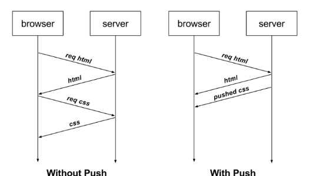

# HTTP Protocol Overview
* HTTP (Hypertext Transfer Protocol) is the foundation of data communication on the World Wide Web. It is an application-layer protocol used for transmitting hypermedia documents, such as HTML.
* HTTP is a request-response protocol, where a client (usually a web browser) sends a request to a server, which then responds with the requested resource.
* HTTP operates over TCP/IP, ensuring reliable data transfer. It is stateless, meaning each request from a client to a server is treated as an independent transaction, without retaining session information.

# 🌐 Difference Between HTTP and HTTP/2

HTTP/1.1 (commonly referred to as HTTP) and HTTP/2 are protocols used for transferring data over the web. HTTP/2 is a major revision aimed at improving speed, performance, and efficiency.

---

## 🔑 Key Differences

| Feature                    | HTTP/1.1                                                                                 | HTTP/2                                                                                 |
| -------------------------- | ---------------------------------------------------------------------------------------- | -------------------------------------------------------------------------------------- |
| **Multiplexing**           | ❌ Not supported – Only one request per TCP connection. Leads to "head-of-line blocking". | ✅ Supported – Multiple requests/responses over a single TCP connection simultaneously. |
| **Header Compression**     | ❌ No compression – Headers sent as plain text, causing redundancy.                       | ✅ Uses HPACK – Compresses headers, reducing overhead.                                  |
| **Binary Protocol**        | ❌ Text-based (human-readable)                                                            | ✅ Binary format (machine-efficient) – More compact and less error-prone.               |
| **Server Push**            | ❌ Not available                                                                          | ✅ Supported – Server can proactively send resources to the client before requested.    |
| **Request Prioritization** | ❌ Not available                                                                          | ✅ Allows prioritization of requests for better performance.                            |
| **Connection Management**  | ❌ Multiple TCP connections needed for parallel requests                                  | ✅ Single TCP connection handles all concurrent streams                                 |
| **Security (TLS)**         | 🔸 Optional                                                                               | 🔸 Optional (but most browsers require TLS for HTTP/2)                                  |

---

### What is server push
#### 🧠 The Usual Way (HTTP/1.1 or No Server Push):
  1. You visit a webpage (e.g., example.com/index.html)
  2. Your browser gets index.html
  3. The browser parses the HTML and sees it needs style.css, app.js, and maybe some images.
  4. The browser then sends separate requests for each of those files.
  5. Server responds with each file as requested.  

🕓 This involves multiple round-trips: first request for the HTML, then more for CSS, JS, images, etc. 

#### 🚀 With Server Push (HTTP/2): 
  1. You visit example.com/index.html
  2. The server knows (e.g., via config or past experience) that you'll definitely need style.css and app.js.
  3. Along with the HTML, the server also pushes style.css and app.js without waiting for you to ask.

Result: Fewer round-trips, faster loading ⚡

#### 📦 In Simple Terms:
* Without Server Push: Client requests → Server responds
* With Server Push: Server says, "Hey, I know you'll need these files too. Here they are!"

### ⚠️ Why Server Push Is Rarely Used Today
* Despite being cool in theory, Server Push has drawbacks:
* It can waste bandwidth if it pushes something the browser already has cached.
* It’s tricky to manage well — pushing too many resources can overload the connection.
* Most browsers and CDNs (like Cloudflare) have either deprecated or disabled support for Server Push in favor of other techniques like preload hints in HTML (`<link rel="preload">`)

---

## Header Compression

## 🚀 Performance Benefits of HTTP/2

- **Faster page loads** due to multiplexing and server push.
- **Reduced latency** and bandwidth usage through header compression.
- **Better resource prioritization**, especially for complex websites with many assets.

---

## 🏁 Summary

| Protocol     | Efficiency | Speed  | Complexity            | Browser Support                                        |
| ------------ | ---------- | ------ | --------------------- | ------------------------------------------------------ |
| **HTTP/1.1** | Lower      | Slower | Simple                | Supported by all                                       |
| **HTTP/2**   | Higher     | Faster | Slightly more complex | Widely supported (Chrome, Firefox, Edge, Safari, etc.) |

---

## 🔧 Compatibility

- Most modern web servers (Apache, Nginx) and CDNs support HTTP/2.
- Browsers **automatically upgrade** to HTTP/2 if the server supports it over HTTPS.

---

## Comparison with HTTP/3
| Feature / Version         | HTTP/1.1               | HTTP/2                        | HTTP/3                           |
| ------------------------- | ---------------------- | ----------------------------- | -------------------------------- |
| **Released**              | 1997                   | 2015                          | 2022 (finalized)                 |
| **Transport Protocol**    | TCP                    | TCP                           | **QUIC (based on UDP)**          |
| **Multiplexing**          | ❌ No                   | ✅ Yes (streams in 1 TCP conn) | ✅ Yes (independent QUIC streams) |
| **Header Compression**    | ❌ No                   | ✅ HPACK                       | ✅ QPACK                          |
| **Binary Protocol**       | ❌ No (text)            | ✅ Yes                         | ✅ Yes                            |
| **Connection Setup**      | Slow (TCP + TLS)       | Faster with reuse             | Fastest (0-RTT possible)         |
| **Head-of-line blocking** | ❌ Yes (TCP limitation) | ⚠️ Reduced but still exists    | ✅ Fully eliminated               |
| **TLS Requirement**       | Optional               | Required by browsers          | ✅ Always encrypted (TLS 1.3)     |
| **Server Push**           | ❌ No                   | ✅ Yes                         | ✅ Yes (but deprecated in QUIC)   |

## 🚀 Key Improvements in HTTP/3
1. QUIC Protocol:
   * Built over UDP instead of TCP.
   * Combines transport (like TCP) and security (TLS 1.3) in one layer.
   * Avoids TCP’s head-of-line blocking.
2. Faster Connections:
   * Supports 0-RTT (Zero Round Trip Time) resumption — data can be sent with the first message.
   * Reduces latency significantly, especially on mobile or unstable networks.
3. Independent Streams:
  * Each request/response runs in its own stream.
  * One lost packet doesn't block other streams.
  
## 📘 References

- [HTTP/2 Specification – RFC 7540](https://datatracker.ietf.org/doc/html/rfc7540)
- [MDN Web Docs – HTTP/2](https://developer.mozilla.org/en-US/docs/Web/HTTP/Overview)

---
