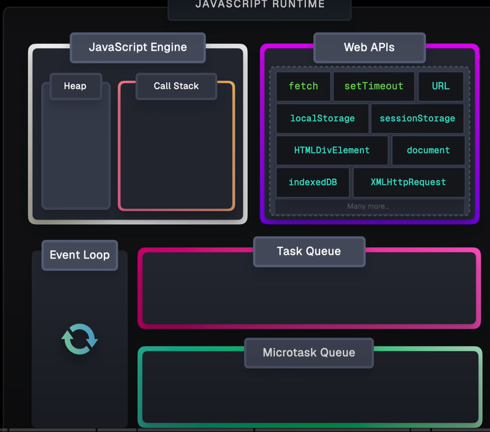
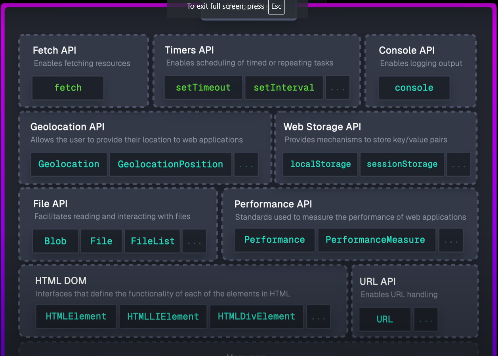
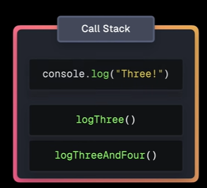

<br><br>
 <br><br>
[JavaScript Visualized - Event Loop, Web APIs, (Micro)task Queue](https://www.youtube.com/watch?v=eiC58R16hb8&list=PLvmkSMJ8O14Cy6cUYQhDRa0AEv7KUUutu)

<br> <br>
[visualization](https://www.jsv9000.app/)

<br >

## Example 1

```js
console.log("One");

console.log("Two");

function logThree() {
  console.log("Three");
}

function logThreeAndFour() {
  logThree();
  console.log("Four");
}

logThreeAndFour();

// One, Two, Three, Four
```

1. new execution context created. call stack take the `console.log("One")` and print 'One'
2. new execution context created, call stack take the `console.log("Two")` and print 'Two'
3. call stack take the `logThreeAndFour()` and following the same
   
4. one by one execution is done, it will pop out

## Micro and Macro task

In JavaScript, the event loop manages how asynchronous operations are handled. It consists of different task queues, primarily macrotask queue and microtask queue.

### Macrotask (Task Queue):

- These are tasks that are executed after the current execution stack is empty.
- Examples of macrotasks include:

  - setTimeout()
  - setInterval()
  - setImmediate() (Node.js) - first priority
  - requestAnimationFrame()
  - I/O operations

Execution Order:
When the call stack is empty, the event loop will check the macrotask queue and execute the first task in the queue.

```js
console.log("Start");

setTimeout(() => {
  console.log("Macrotask - setTimeout");
}, 0);

console.log("End");
//  ---------------------------- output --------------------
// Start
// End
// Macrotask - setTimeout
```

### Microtask (Job Queue):

- These are tasks that are executed immediately after the current execution stack is empty but before any macrotask.

* Examples of microtasks include:
  - Promise.then()
  - MutationObserver
  - queueMicrotask()
* Execution Order:
  - Microtasks are given higher priority and are executed before the next macrotask.

```js
console.log("Start");

setTimeout(() => {
  console.log("Macrotask - setTimeout");
}, 0);

Promise.resolve().then(() => {
  console.log("Microtask - Promise");
});

console.log("End");

/*
Start
End
Microtask - Promise
Macrotask - setTimeout
*/
```

## Example
```js
console.log("Start");

setTimeout(() => {
  console.log("Timeout");
}, 0);

setImmediate(() => {
  console.log("Immediate");
});

process.nextTick(() => {
  console.log("Next Tick");
});

Promise.resolve().then(() => {
  console.log("Promise");
});

console.log("End");

/*
Start
End
Next Tick
Promise
Immediate
Timeout
*/
```