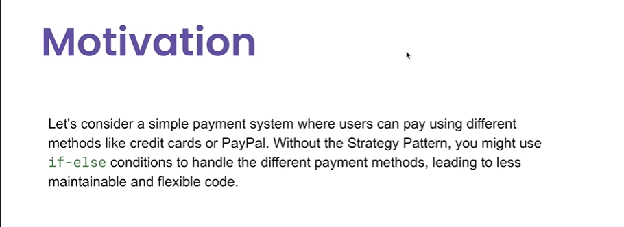
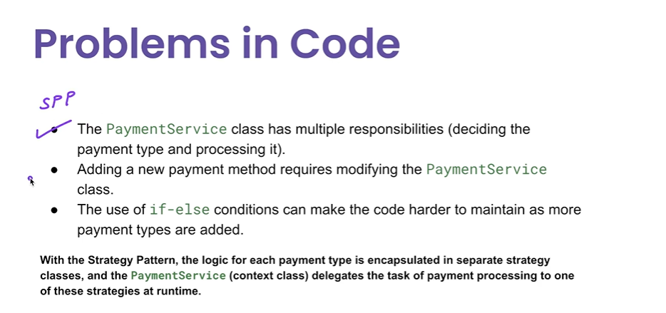

# Strategy Pattern

1. What is the primary purpose of the Strategy design pattern?  
To enable an object to change its behavior at runtime by selecting from different algorithms  
2. real-world applications usage?  
Different sorting algorithms (quick sort, merge sort) chosen at runtime based on the dataset.  
3. What is a key benefit of using the Strategy design pattern?
It improves the code's flexibility by making algorithms interchangeable.  
4. How is the Strategy pattern typically implemented?  
By creating an interface for strategies, with different concrete classes implementing the interface.  
5. Which of the following best describes how the Strategy pattern adheres to the Open/Closed Principle?  
By Making it easy to add new strategies without modifying existing code.

