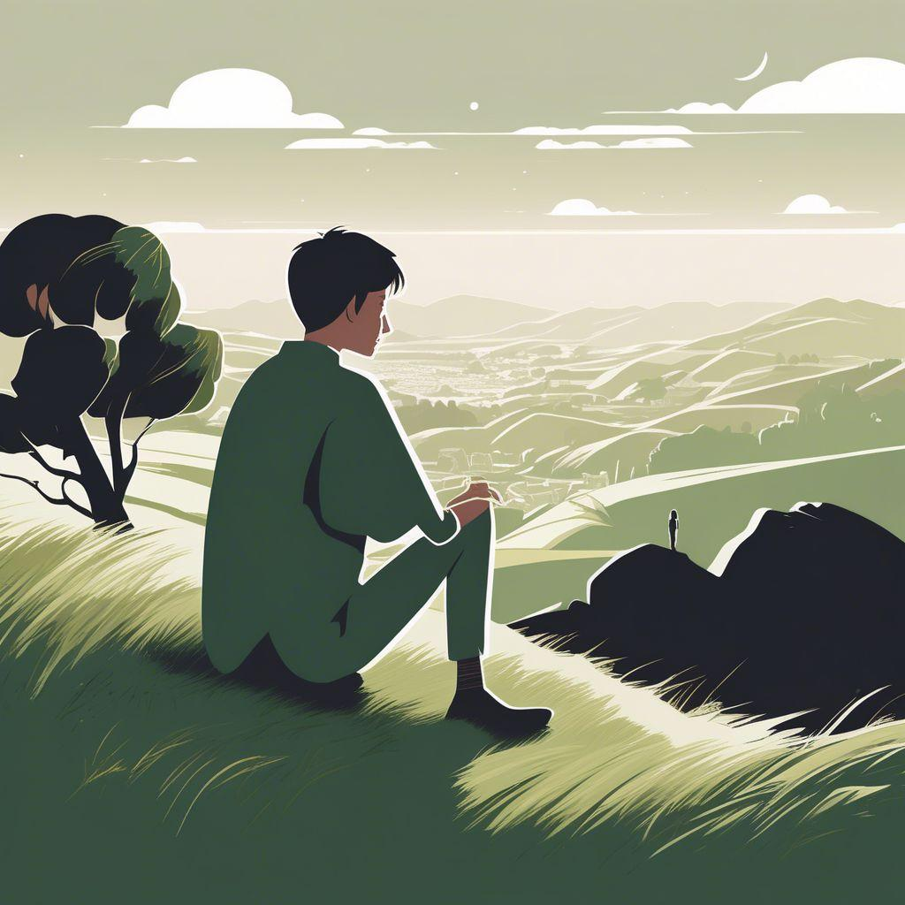
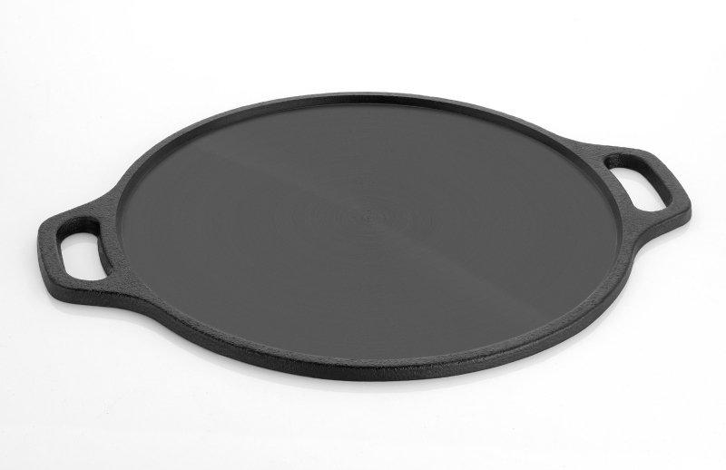

# 📚 English Vocabulary

> Auto-generated file. Do not edit manually.

---

| Image | Word | Pronunciation | Meaning | Example Sentences | My Sentence | Related Words |
| :---: | :--- | :---: | :--- | :--- | :--- | :--- |
|  | **kitten** | /ˈkɪtən/ | A young cat. | • The kitten is sleeping.  • I found a small kitten.  • The kitten is playing with a ball.  • My son likes the kitten. | Yesterday, I saw a cute kitten near my house. | cat, puppy, pet, animal |
|  | **solitude** | /ˈsɒlɪtjuːd/ (UK), /ˈsɑːlɪtuːd/ (US) | The state of being alone, especially when it is peaceful and enjoyed. | • She enjoyed the solitude of the forest.  • After work, he spent an hour in solitude.  • The mountain cabin offered complete solitude.  • Sometimes, solitude helps us think clearly. | I enjoy a few minutes of solitude every morning before starting my work. | alone, peace, silence, isolation, privacy, calm |
|  | **griddle** | /ˈɡrɪd.əl/ | A flat cooking surface or pan used for cooking foods such as pancakes, eggs, dosa, roti, or burgers. | • She cooked pancakes on the griddle.  • The chef heated the griddle before making burgers.  • My mother makes crispy dosa on a hot griddle.  • Clean the griddle after cooking. | I bought a new griddle to make dosa and pancakes at home. | pan, skillet, cook, stove, dosa, pancake |

---

## Statistics

| Total Words |
| :---: |
| 3 |
