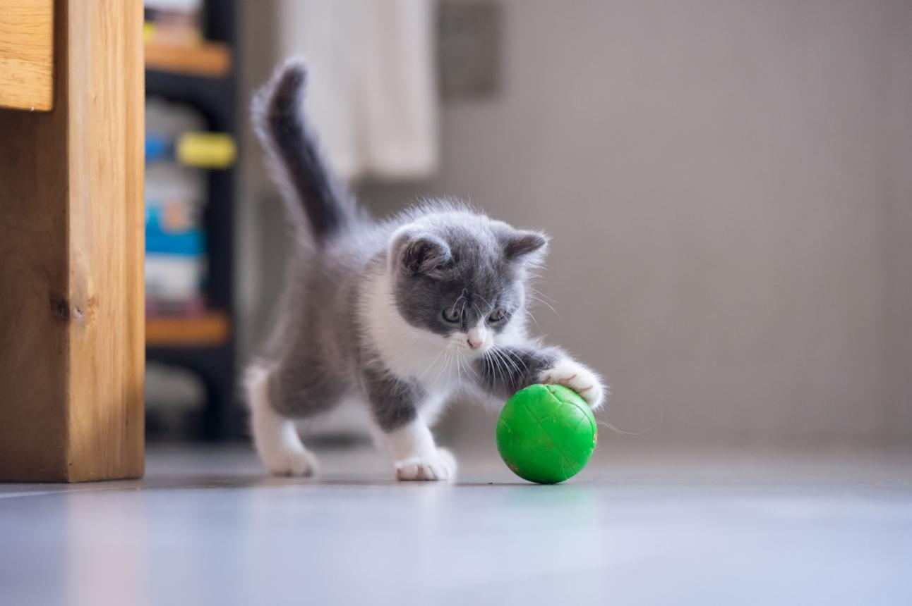

# 📚 English Vocabulary

> This repository contains my personal English vocabulary.
>
> Each word includes:
>
> * Image
> * Meaning
> * Example sentences
> * My own sentence
> * Related words

---

## Vocabulary

|                           Image                           | Word       | Pronunciation | Meaning      | Example Sentences                                                                                                                                    | My Sentence                                   | Related Words           |
| :-------------------------------------------------------: | :--------- | :-----------: | :----------- | :--------------------------------------------------------------------------------------------------------------------------------------------------- | :-------------------------------------------- | :---------------------- |
|  | **kitten** |   /ˈkɪtən/    | A young cat. | • The kitten is sleeping. • I found a small kitten near my house. • The kitten is playing with a ball. • My son likes the kitten very much. | Yesterday, I saw a cute kitten near my house. | cat, puppy, pet, animal |

---

## Notes

* Add one new word every day.
* Speak each example sentence aloud at least five times.
* Try to write your own sentence without using a translator.
* Review the words every week.

---

## Statistics

| Total Words | Last Updated |
| :---------: | :----------: |
|      1      |  2026-06-28  |
